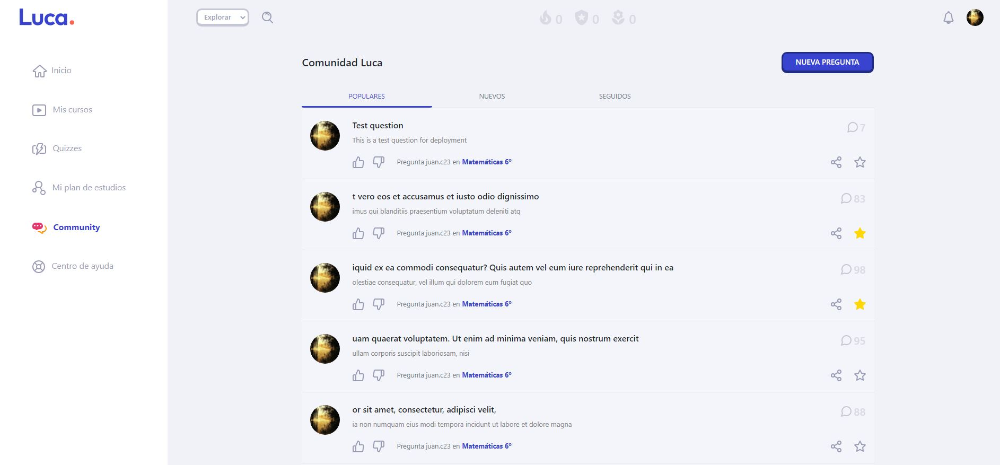

# Luca Frontend Task

A web app for asking and iteracting with questions.

## About this project

This Application is built as a front end app consuming a Ruby on Rails [API](https://serene-atoll-18212.herokuapp.com/) separately deployed to Heroku.

## End Points

There are a couple of endpoints exposed by this api and can be accessed online using [this path](https://serene-atoll-18212.herokuapp.com/) as the base Url.

POST -/stars - (stars and unstars a question) -/questions - (creates question)

GET -/questions - (fetch all questions)

## Built With

- ReactJs
- React Hooks
- Rails API
- Redux
- Axios
- Netlify (For deployment)
- CSS (Modules)
- HTML
- Webpack
- ES6 JavaScript.
- Formik and yup for forms and validations.
- Toaster for messages.

## Live Demo

For the full working application click [here](https://luca-task.netlify.app/Community)

## Installation

To get a local copy up and running follow these simple example steps.

### Setup

Clone [this](https://github.com/SafaErden/luca.git) repo

### Follow:

1. cd into the project directory
2. run => npm install
3. run => npm start
4. Navigate to localhost:3000

### This project is currently fetching data from Heroku servers. If you want to connect to your local api; update the base URL 'src/api/index.js' from current state to 'http://localhost:3001/'. Then run your local backend service on port:3001

## Author

👤 **Safa ERDEN**

- Github: [@SafaErden](https://github.com/SafaErden)
- Twitter: [@safaerden](https://twitter.com/safaerden)
- Linkedin: [SafaErden](https://www.linkedin.com/in/safaerden/)
- Mql5: [safaerden](https://www.mql5.com/en/users/safaerden)
- Email: [safaerden](mailto:safaerden@gmail.com)

## 🤝 Contributing

Contributions, issues and feature requests are welcome!

Feel free to check the [issues page](https://github.com/SafaErden/luca/issues)

## Show your support

Give a ⭐️ if you like this project!
